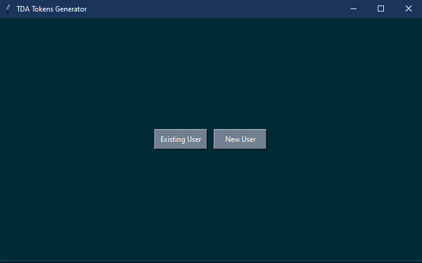
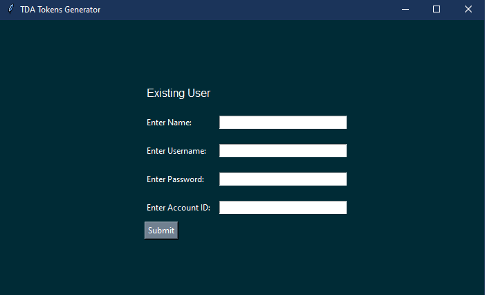
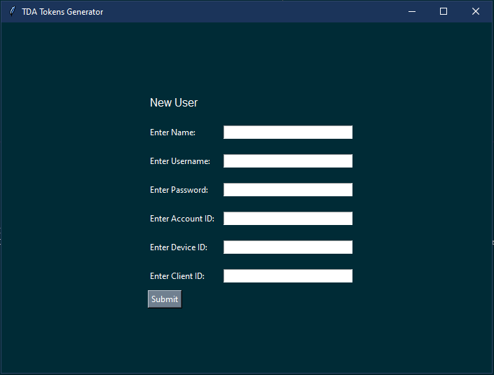
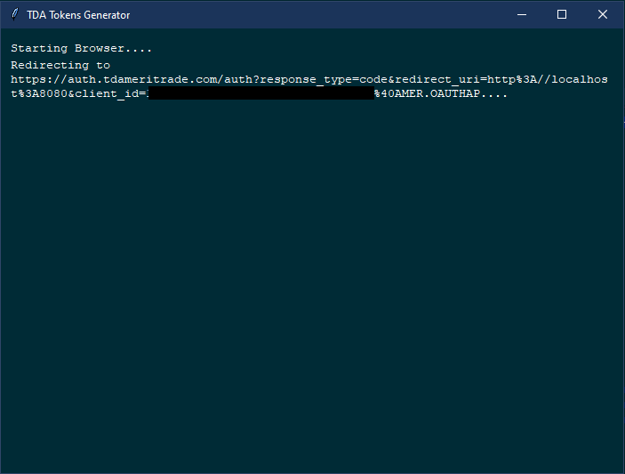
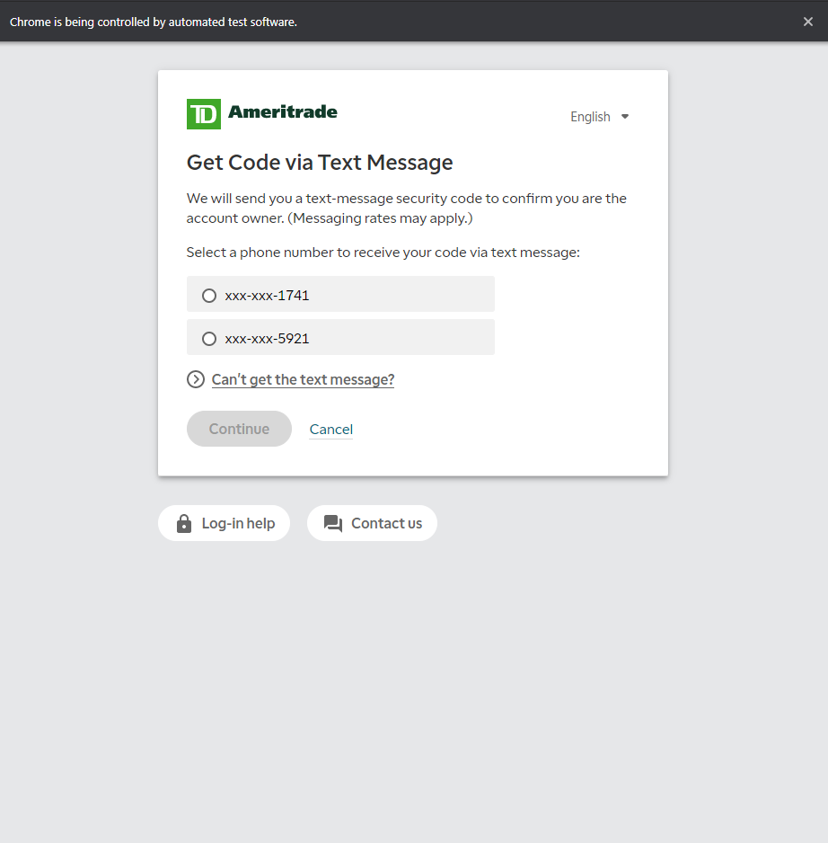
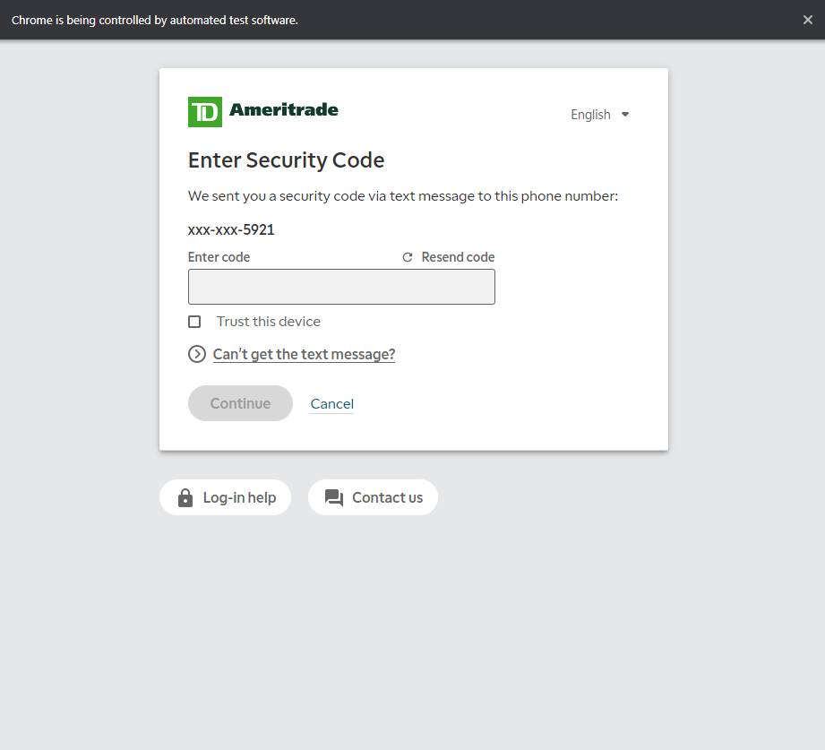
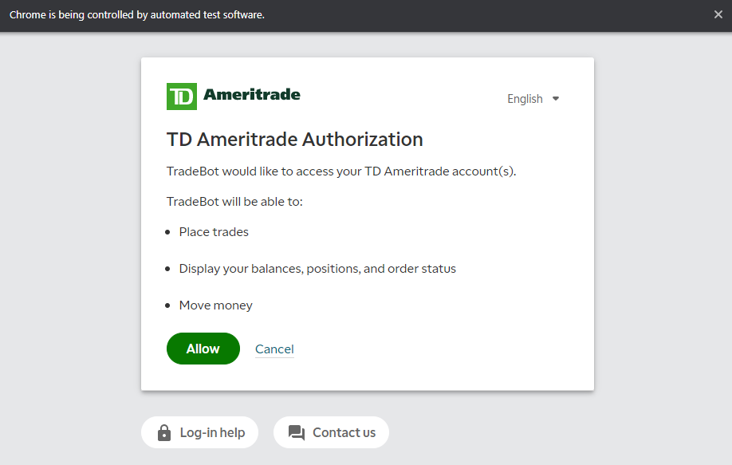

# TDA Tokens Generator

### DESCRIPTION

- This program allows you to obtain access and refresh tokens via OAuth through the TDAmeritrade API.

### DEPENDENCIES

> [dev-packages]

> [packages]

- selenium
- termcolor
- colorama
- pymongo
- dnspython
- python-dotenv
- requests
- webdriver-manager
- bcrypt

> [venv]

- pipenv

> [requires]

- python_version = "3.8"

### HOW IT WORKS

- The purpose of this program is to obtain access and refresh tokens from TDAmeritrade for a specific account, and store that information in your MongoDB database.

- There are two types of users you can select from:

    1. Existing User - User already has a collection in Mongo. If the user inputs an existing account id, then the account specified will be the one updated. If account id is new, then it will be added.

    2. New User - User does not exist in collection in Mongo. User info will be inserted into the users collection along with new tokens.

#### Decision Screen

- When you start the program, you will be introduced with two buttons. One that says Existing User, and the other says New User. Choose the appropriate button.

#### Existing User Screen

- If you selected Existing User, you will be directed to a screen that looks like the image below:

- **Name** - This is the users name (First and Last)

- **Username** - This is the username for the TDAmeritrade account you are using.

- **Password** - This is the password for the TDAmeritrade account you are using.

- **Account ID** - This is the account id for the TDAmeritrade account you are using.

#### New User Screen

- If you selected New User, you will be directed to a screen that looks like the image below:

- **Name** - This is the users name (First and Last)

- **Username** - This is the username for the TDAmeritrade account you are using.

- **Password** - This is the password for the TDAmeritrade account you are using.

- **Account ID** - This is the account id for the TDAmeritrade account you are using.

- **Device ID** - This is the device id for the Pushsafer API. This id is what allows you to push notifications from the program to your phone or any other device. https://www.pushsafer.com/

- **Client ID** - This is the client id created when you create an app in the TDA Developers site here: https://developer.tdameritrade.com/apis. This is different than your TDAmeritrade account, and you will have to register. Once registered, login and you will see a tab that says My Apps. Click the tab, and click on the tab that says Add A New App. Once clicked, a page will load and will ask you for an App Name, Callback URL, and What is the purpose of this application. Name it whatever you want, the Callback url needs to be http://localhost:8080, and describe a purpose for the app. Then click the Create App button. Once you do that, go to where you can view all of your apps. Click on the app you just created, and click on the Keys tab. Look for the Consumer Key. That is your **Client ID**.

- **Account Type** - Can be PRIMARY or SECONDARY. Technically, you can set this to more than just these two options. This seperates the accounts and each trade in the program. Basically, when you set the scanner names in Thinkorswim, you will append this value to the end of the scanner name, telling the program that the specific strategy is for either the PRIMARY or SECONDARY account. 

- **Asset Type** - Either EQUITY or OPTION for the specific account. This tells the program what this account should be trading.

#### After Submission

- After you submit the form for either Existing User or New User, you will be redirected to the page below:

- The web browser will auto initiate and redirect to the oauth authentication url.

- You should see a new browser pop up. Do not exit. A page with a login form will display. The program will automatically insert the username and password for your account that you previously inputted, and then auto log you in. If successful, you will be redirected to the page below:

- We will need to get a code to verify our account. Either select a phone number you want the code to be sent to, or you can click the link below that says Can't get the text message? and you will be allowed to answer a security question. If successful, you will be redirected to the page below:

- Once received to your phone, enter security code and then click continue. If you answered security question, then you will have skipped this part. If successful, you will be redirected to the page below:

- Click the Allow button, and the browser will close.

- The rest of the program will continue to run, and the required info from the authentication process that we just finished will be used to obtain your access and refresh tokens.

- Your all set. Your user info and tokens will be added/updated in the users collection in Mongo. Now you will be able to run your account in the program!

- For more info on the TDA authentication process, see this link: https://developer.tdameritrade.com/content/authentication-faq
